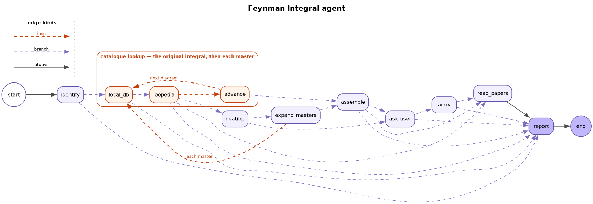
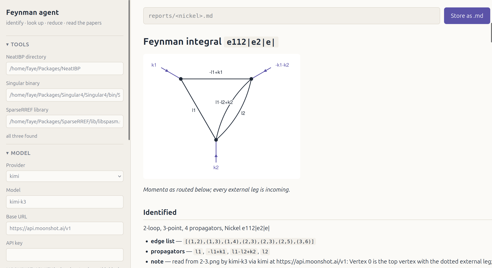
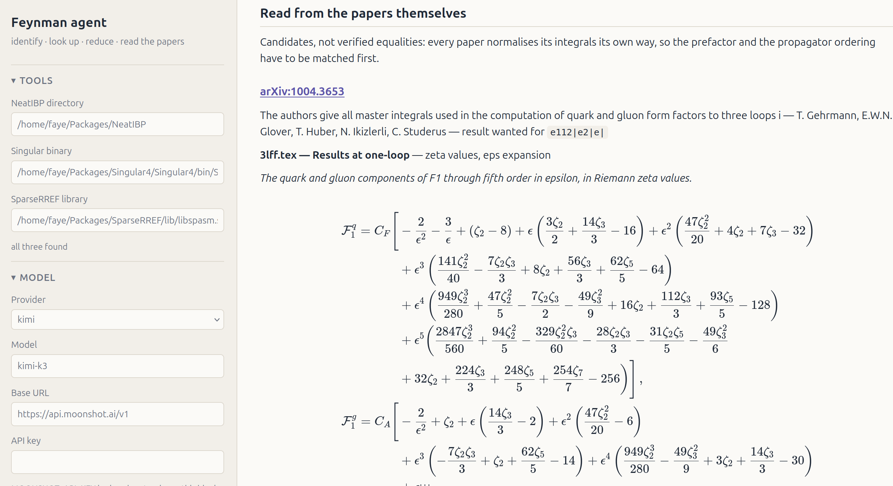

# Feynman Integral Agent

**FeynAgent** is an automated workflow for Feynman integral identification, lookup, and reduction. It identifies an input integral, searches local databases and Loopedia, and—when no reference exists—reduces the diagram to master integrals using NeatIBP to search for those instead. The agent always generates a structured Markdown/LaTeX report containing the results or, if the evaluation fails, detailing the findings, reduction steps, and what it tried.


## Workflow


## Quick example
```bash
# Run via CLI (generates a Markdown + SVG report in reports/)
python -m feynman_agent 'e12|e3|34|5|e5|e|'

# Or run with the browser GUI
python -m feynman_agent.web --open
```

The web interface provides interactive diagram input and visualizes pipeline progress in real time:  



For installation steps, mass configurations, provider setup, and advanced options, see [`usage.md`](./usage.md).


## Requirements

 - Python 3.10+ (langgraph, langchain-core, arxiv)
 - [NeatIBP](https://github.com/yzhphy/NeatIBP)
 - [Singular](https://www.singular.uni-kl.de/public/) & [SpaSM](https://github.com/munuxi/SparseRREF) (for real IBP reductions)
 - [Wolfram Engine](https://www.wolfram.com/engine/) (or *Mathematica*)


## Todo
- Automatic tensor reduction via [OPITeR](https://doi.org/10.1016/j.cpc.2025.109606)
