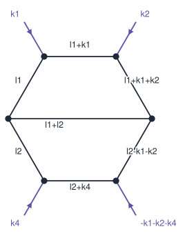

# Feynman integral `e12|e3|34|5|e5|e|`



*Momenta as routed below; every external leg is incoming.*

## Identified

2-loop, 4-point, 7 propagators, Nickel e12|e3|34|5|e5|e|

- **edge list** — `[(1,2),(1,3),(1,7),(2,4),(2,6),(3,4),(3,8),(4,5),(5,6),(5,9),(6,10)]`
- **propagators** — `l1`, `l1+k1`, `l1+k1+k2`, `l2-k1-k2`, `l2+k4`, `l2`, `l1+l2`
- **numerator** — `(l1.k4)^2 - 3*l2^2`
- **note** — restored implicit 4-th external leg from momentum conservation
- **note** — treated 2 of 9 entries as ISPs: l1+k4, l2+k1

## Result

*From the Loopedia catalogue.*

Loopedia knows this graph (`e12|e3|34|5|e5|e|`). It indexes references, not closed
forms, so the result itself lives in these papers:

- [hep-ph/9905323](https://arxiv.org/abs/hep-ph/9905323) — V.A. Smirnov
  - masses: `000|00|00|0|00|0|`
  - orders in eps: `-4,-3,-2,-1,0`
  - Massless on-shell double box, expressed in terms of polylogarithms and generalized polylogarithms.
- [hep-ph/9907385](https://arxiv.org/abs/hep-ph/9907385) — V.A. Smirnov, O.L. Veretin
  - masses: `000|00|00|0|00|0|`
  - orders in eps: `-4,-3,-2,-1,0`
  - The authors give relations derived from the IBP identities allowing the computation of any planar massless on-shell double box, with any powers of the propagato
- [arXiv:1306.6344](https://arxiv.org/abs/1306.6344) — Thomas Gehrmann, Lorenzo Tancredi, Erich Weihs
  - masses: `000|00|00|0|10|1|`
  - orders in eps: `-4,-3,-2,-1,0`
- [arXiv:1404.4853](https://arxiv.org/abs/1404.4853) — Thomas Gehrmann, Andreas von Manteuffel, Lorenzo Tancredi, Erich Weihs
  - masses: `000|00|00|0|10|1|`
  - orders in eps: `0,1,2,3,4`
  - masters: 3
  - The authors compute the full set of massless two-loop four-point functions with two off-shell legs with the same invariant mass relevant for diboson production 
- [arXiv:1712.02537](https://arxiv.org/abs/1712.02537) — Matteo Becchetti, Roberto Bonciani
  - masses: `000|00|11|1|01|0|`
- [arXiv:1306.6344](https://arxiv.org/abs/1306.6344) — Thomas Gehrmann, Lorenzo Tancredi, Erich Weihs
  - masses: `000|10|00|0|00|1|`
  - orders in eps: `-4,-3-2,-1,0`
- [arXiv:1404.4853](https://arxiv.org/abs/1404.4853) — Thomas Gehrmann, Andreas von Manteuffel, Lorenzo Tancredi, Erich Weihs
  - masses: `000|10|00|0|00|1|`
  - orders in eps: `0,1,2,3,4`
  - masters: 2
  - The authors compute the full set of massless two-loop four-point functions with two off-shell legs with the same invariant mass relevant for diboson production 
- [arXiv:1306.6344](https://arxiv.org/abs/1306.6344) — Thomas Gehrmann, Lorenzo Tancredi, Erich Weihs
  - masses: `000|10|00|0|10|0|`
  - orders in eps: `-2,-1,0`

*(cite [arXiv:1709.01266](https://arxiv.org/abs/1709.01266) for Loopedia)*

## Master integrals (8)

`(l1.k4)^2 - 3*l2^2` over these propagators is 1/4 G[-1,1,1,1,1,1,1,0,0] - 1/2 G[0,1,1,1,1,1,1,-1,0] - 3 G[1,1,1,1,1,0,1,0,0] + 1/4 G[1,1,1,1,1,1,1,-2,0], each term reduced to the masters below.

- ✓ `G[1, 1, 1, 1, 1, 1, 1, 0, -1]` — `e12|e3|34|5|e5|e|` (2L 4pt)
  - local: massless planar double box · [hep-ph/9905323](https://arxiv.org/abs/hep-ph/9905323) · [hep-ph/9907385](https://arxiv.org/abs/hep-ph/9907385) · [arXiv:1306.6344](https://arxiv.org/abs/1306.6344)
- ✓ `G[1, 1, 1, 1, 1, 1, 1, 0, 0]` — `e12|e3|34|5|e5|e|` (2L 4pt)
  - local: massless planar double box · [hep-ph/9905323](https://arxiv.org/abs/hep-ph/9905323) · [hep-ph/9907385](https://arxiv.org/abs/hep-ph/9907385) · [arXiv:1306.6344](https://arxiv.org/abs/1306.6344)
- ✓ `G[1, 1, 0, 1, 1, 0, 1, 0, 0]` — `e12|e23|e3|e|` (2L 4pt)
  - [hep-ph/9912329](https://arxiv.org/abs/hep-ph/9912329) · [arXiv:1306.6344](https://arxiv.org/abs/1306.6344) · [arXiv:1404.4853](https://arxiv.org/abs/1404.4853)
- ✓ `G[1, 1, 1, 0, 1, 0, 1, 0, 0]` — `e112|e3|e3|e|` (2L 4pt)
  - [arXiv:1306.6344](https://arxiv.org/abs/1306.6344) · [arXiv:1404.4853](https://arxiv.org/abs/1404.4853) · [arXiv:1402.7078](https://arxiv.org/abs/1402.7078)
- ✓ `G[1, 0, 1, 0, 1, 0, 1, 0, 0]` — `ee12|e22|e|` (2L 4pt), matched as `e112|e2|e|` with its external legs merged
  - [arXiv:1004.3653](https://arxiv.org/abs/1004.3653) · [hep-ph/9912329](https://arxiv.org/abs/hep-ph/9912329) · [arXiv:1402.7078](https://arxiv.org/abs/1402.7078)
- ? `G[1, 0, 1, 1, 0, 1, 0, 0, 0]` — `ee11|22|ee|` (2L 4pt)
  - no reference found
- ✓ `G[0, 1, 0, 0, 1, 0, 1, 0, 0]` — `ee111|ee|` (2L 4pt), matched as `e111|e|` with its external legs merged
  - local: massless two-loop sunset

  ```
  see notebook /home/faye/tmp/Feynman_Agent/data/notebooks/massless_sunset.wl
  ```
- ✓ `G[1, 0, 0, 1, 0, 0, 1, 0, 0]` — `ee111|ee|` (2L 4pt), matched as `e111|e|` with its external legs merged
  - local: massless two-loop sunset

  ```
  see notebook /home/faye/tmp/Feynman_Agent/data/notebooks/massless_sunset.wl
  ```

## What was done

- ✓ **identify** — 2-loop, 4-point, 7 propagators, Nickel e12|e3|34|5|e5|e|
- · **local database** — 1 entry/entries for this Nickel index but no stored result
- ✓ **loopedia** — 11 record(s) across 11 mass configuration(s)
- ✓ **NeatIBP** — 8 master integrals, 30 IBP relations — targets: (l1.k4)^2 - 3*l2^2 = 1/4 G[-1,1,1,1,1,1,1,0,0] - 1/2 G[0,1,1,1,1,1,1,-1,0] - 3 G[1,1,1,1,1,0,1,0,0] + 1/4 G[1,1,1,1,1,1,1,-2,0]
- ✓ **master sectors** — 8 masters span 6 distinct diagram(s), queued for lookup
- ~ **assemble** — 8 master integrals, 7 resolved by the catalogue loop, 2 with a stored closed form
- ✓ **ask user** — stop requested
